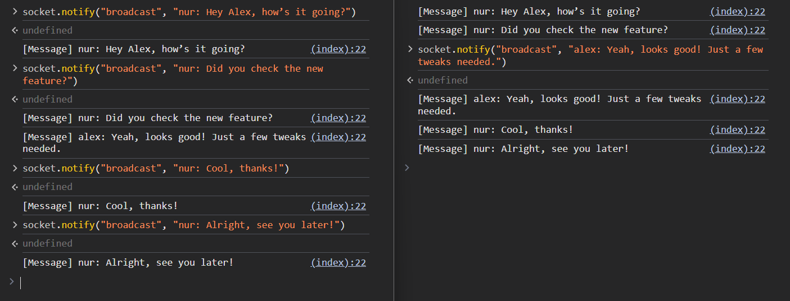

# Broadcasting

To implement broadcasting functionality, we need to utilize the concept of
[Room](https://socket.io/docs/v4/rooms/):

> A room is an arbitrary channel that sockets can `join` and `leave`. It can be
> used to broadcast events to a subset of clients.

## Room Implementation

To [implement room](https://socket.io/docs/v4/rooms/#implementation-details), we
need to store `Notifier` in a map. To broadcast a message, we can simply iterate
through the map and send the packet to all sockets.

To avoid [shared memory](https://en.wikipedia.org/wiki/Shared_memory) issues, we
can use the [Actor](https://en.wikipedia.org/wiki/Actor_model) pattern.

```rust
# use axum_socket_io::Notifier;
# use std::{collections::HashMap, sync::LazyLock};
# use tokio::sync::mpsc::{self, Sender};
#
pub enum Room {
    Join { id: u16, notifier: Notifier },
    Broadcast(&'static str, Box<[u8]>),
    Leave { id: u16 },
}

impl Room {
    pub async fn dispatch(self) {
        TASK.send(self).await.unwrap()
    }
}

pub static TASK: LazyLock<Sender<Room>> = LazyLock::new(|| {
    let (tx, mut rx) = mpsc::channel::<Room>(16);
    tokio::spawn(async move {
        let mut main_room = HashMap::new();

        while let Some(action) = rx.recv().await {
            match action {
                Room::Join { id, notifier } => {
                    main_room.insert(id, notifier);
                }
                Room::Broadcast(ev, msg) => {
                    for user in main_room.values() {
                        user.notify(ev, &msg).await.unwrap();
                    }
                }
                Room::Leave { id } => {
                    main_room.remove(&id);
                }
            }
        }
    });
    tx
});
```

## Server-Side (Rust)

[socket.notifier()](https://docs.rs/web-socket-io/latest/web_socket_io/struct.SocketIo.html#method.notify)
method returns a
[Notifier](https://docs.rs/web-socket-io/latest/web_socket_io/struct.Notifier.html),
which is responsible for sending notifications.

`Notifier` is very cheap to create, so you can efficiently create multiple
instances as needed.

```rust
# use crate::room::*;
# use axum_socket_io::{Procedure, SocketIo};
# use std::{net::SocketAddr, time::Duration};
# use tokio::time::sleep;
#
pub async fn handle_socket(mut socket: SocketIo, addr: SocketAddr) {
    let id = addr.port();
    let notifier = socket.notifier();
    Room::Join { id, notifier }.dispatch().await;
#     println!("A user connected: {addr:#?}");

    while let Ok(ev) = socket.recv().await {
        match ev {
            Procedure::Notify(req) => match req.method() {
                "broadcast" => {
                    Room::Broadcast("message", req.data().into())
                        .dispatch()
                        .await
                }
#                 "ping" => socket.notify("pong", req.data()).await.unwrap(),
#                 _ => {}
                /* ... */
            },
#             Procedure::Call(req, res, c) => match req.method() {
#                 "myip" => res.send(addr.to_string()).await.unwrap(),
#                 "uppercase" => {
#                     let msg = std::str::from_utf8(req.data()).unwrap();
#                     res.send(msg.to_uppercase()).await.unwrap()
#                 }
#                 "long_runing_task" => {
#                     c.spawn_and_abort_on_reset(async {
#                         sleep(Duration::from_secs(3)).await;
#                         res.send("done!").await.unwrap();
#                     });
#                 }
#                 _ => {}
#             },
            /* ... */
        }
    }

#     println!("user disconnected: {addr:#?}");
    Room::Leave { id }.dispatch().await;
}
```

## Client-Side (JavaScript)

```javascript
#import { SocketIo } from "https:#sm.sh/client-socket-io@0.1.0";
#const decodeText = (data) => new TextDecoder().decode(data);
#
#window.socket = new SocketIo("ws://127.0.0.1:3000/socket");
#await socket.connect();
#
#window.rpc = async (...args) => decodeText(await socket.call(...args));
#
#window.long_runing_task = async (timeout) => {
#    const c = new AbortController();
#    setTimeout(() => c.abort("TimeOut!"), timeout);
#
#    const start = performance.now();
#    const output = await rpc("long_runing_task", [], { signal: c.signal });
#    const end = performance.now();
#    return `${output}: ${Math.round(end - start)}ms`;
#};
#
async function onMessage() {
    for await (const msg of socket.on("message")) {
        console.log("[Message]", decodeText(msg));
    }
}
#
#async function onPong() {
#    for await (const msg of socket.on("pong")) {
#        console.log("[Pong]", decodeText(msg));
#    }
#}
#
#[onPong, onMessage].forEach((fn) => fn().catch(console.error));
```


