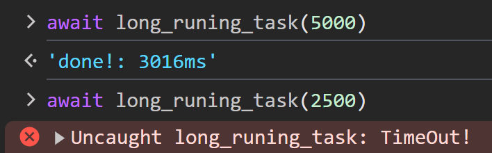

# Cancellation

When a client is no longer interested in the result of an RPC call, client can
cancel the request to inform the server. The server should stop any ongoing
processing.

## Server-Side (Rust)

In this example, `c.spawn_and_abort_on_reset(<task>)` spawn a tokio task that
will be automatically aborted if the connection is lost or the client sends a
`reset` frame.

`"long_runing_task"` procedure take 3s to finished, Client can request to cancle
the process by sending a `reset` frame at any time.

```rust
#use axum_socket_io::{Procedure, SocketIo};
#use std::{net::SocketAddr, time::Duration};
#use tokio::time::sleep;
#
pub async fn handle_socket(mut socket: SocketIo, addr: SocketAddr) {
#    println!("A user connected: {addr:#?}");
    while let Ok(ev) = socket.recv().await {
        match ev {
            /* ... */
#            Procedure::Notify(req) => match req.method() {
#                "ping" => socket.notify("pong", req.data()).await.unwrap(),
#                _ => {}
#            },
            Procedure::Call(req, res, c) => match req.method() {
#                "myip" => res.send(addr.to_string()).await.unwrap(),
#                "uppercase" => {
#                    let msg = std::str::from_utf8(req.data()).unwrap();
#                    res.send(msg.to_uppercase()).await.unwrap()
#                }
                "long_runing_task" => {
                    c.spawn_and_abort_on_reset(async {
                        sleep(Duration::from_secs(3)).await;
                        res.send("done!").await.unwrap();
                    });
                }
                _ => {}
            },
        }
    }
#    println!("user disconnected: {addr:#?}");
}
```

Note that cancellation only applies to asynchronous tasks (`Future`) at the
`.await` point.

#### Warning

It is the responsibility of the developer to implement an appropriate undo
mechanism if needed. Ensure that your code handles cancellation gracefully to
avoid unintended side effects.

## Client-Side (JavaScript)

`AbortController` is used to signal cancellation for an rpc request, similar to
the `fetch()` API.

```javascript
#<script type="module">
#import { SocketIo } from "https://esm.sh/client-socket-io@0.1.0";
#const decodeText = (data) => new TextDecoder().decode(data);
#
#window.socket = new SocketIo("ws://127.0.0.1:3000/socket");
#await socket.connect();
#
#window.rpc = async (...args) => decodeText(await socket.call(...args));
#
window.long_runing_task = async timeout => {
    const c = new AbortController();
    setTimeout(() => c.abort("TimeOut!"), timeout);

    const start = performance.now();
    const output = await rpc("long_runing_task", [], { signal: c.signal });
    const end = performance.now();
    return `${output}: ${Math.round(end - start)}ms`;
};
#
#async function onPong() {
#    for await (const msg of socket.on("pong")) {
#        console.log("[Pong]", decodeText(msg));
#    }
#}
#
#[onPong].forEach((fn) => fn().catch(console.error));
#</script>
```


