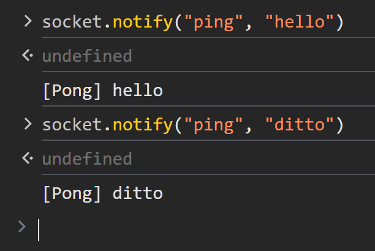

# Notify events

The Notify events enables bi-directional, event-based communication between
clients and servers. This allows both sides to send and receive notifications
without waiting for a response.

## Server-Side Example (Rust)

Let's walk through a basic "Ping-Pong" example, where the client sends a
`"ping"` notification to the server, and the server responds with a `"pong"`
echoing back the same data received.

```rust
# use axum_socket_io::{Procedure, SocketIo};
# use std::net::SocketAddr;
#
pub async fn handle_socket(mut socket: SocketIo, addr: SocketAddr) {
#   println!("A user connected: {addr:#?}");
    while let Ok(ev) = socket.recv().await {
        match ev {
            Procedure::Notify(req) => match req.method() {
                "ping" => socket.notify("pong", req.data()).await.unwrap(),
                _ => {}
            }
            Procedure::Call(req, res, _) => { /* ... */ }
        }
    }
#   println!("user disconnected: {addr:#?}");
}
```

## Client-Side Example (JavaScript)

The `socket.on(<eventName>)` method returns an asynchronous iterator, allowing
you to use a `for await` loop to continuously listen for events as they arrive:

```javascript
#<script type="module">
#import { SocketIo } from "https://esm.sh/client-socket-io@0.1.0";
const decodeText = data => new TextDecoder().decode(data);
#
#window.socket = new SocketIo("ws://127.0.0.1:3000/socket");
#await socket.connect();

async function onPong() {
    for await (const msg of socket.on("pong")) {
        console.log("[Pong]", decodeText(msg));
    }
}

[onPong].forEach(fn => fn().catch(console.error));
#</script>
```

#### Sending a Notification



`socket.notify(<eventName>, <data>)` sends a notification message to the server
without waiting for a response.

- `<eventName>: string`: The name of the event you want to send. This string
  identifies the type of notification (e.g., `"ping"`, `"update"`, etc.),

- `<data>: Uint8Array | string`: The data associated with the event. It can
  either be:
  - A array of byte (`Uint8Array`).
  - A `string`, which will be encoded to UTF-8 bytes before being transmitted.


