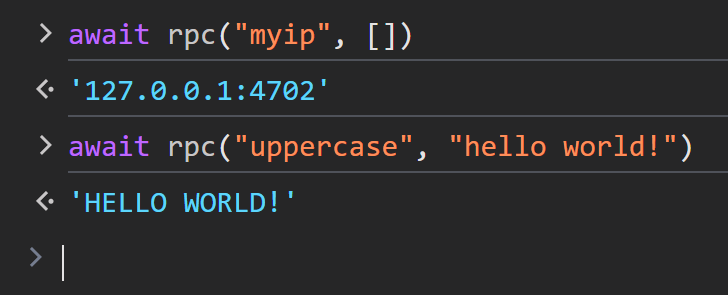

# Request–Response

The [request–response](https://en.wikipedia.org/wiki/Request%E2%80%93response)
enables clients to send a request to the server and receive a direct response.

## Server-Side Example (Rust)

This example demonstrates handling request–response events, where the server
responds to specific client requests. For example:

- `myip`: Returns the client's IP address.
- `uppercase`: Converts the provided message to uppercase and sends it back.

```rust
# use axum_socket_io::{Procedure, SocketIo};
# use std::net::SocketAddr;
#
pub async fn handle_socket(mut socket: SocketIo, addr: SocketAddr) {
#     println!("A user connected: {addr:#?}");
    while let Ok(ev) = socket.recv().await {
        match ev {
            /* ... */
#             Procedure::Notify(req) => match req.method() {
#                 "ping" => socket.notify("pong", req.data()).await.unwrap(),
#                 _ => {}
#             },
            Procedure::Call(req, res, _) => match req.method() {
                "myip" => res.send(addr.to_string()).await.unwrap(),
                "uppercase" => {
                    let msg = std::str::from_utf8(req.data()).unwrap();
                    res.send(msg.to_uppercase()).await.unwrap()
                }
                _ => {}
            },
        }
    }
#     println!("user disconnected: {addr:#?}");
}
```

## Client-Side Example (JavaScript)

```javascript
#<script type="module">
#import { SocketIo } from "https://esm.sh/client-socket-io@0.1.0";
#const decodeText = data => new TextDecoder().decode(data);
#
#window.socket = new SocketIo("ws://127.0.0.1:3000/socket");
#await socket.connect();
#
window.rpc = async (...args) => decodeText(await socket.call(...args))
#
#async function onPong() {
#    for await (const msg of socket.on("pong")) {
#        console.log("[Pong]", decodeText(msg));
#    }
#}
#
#[onPong].forEach((fn) => fn().catch(console.error));
#</script>
```



The `socket.call(...)` method is used to send a request to the server and wait for a response.